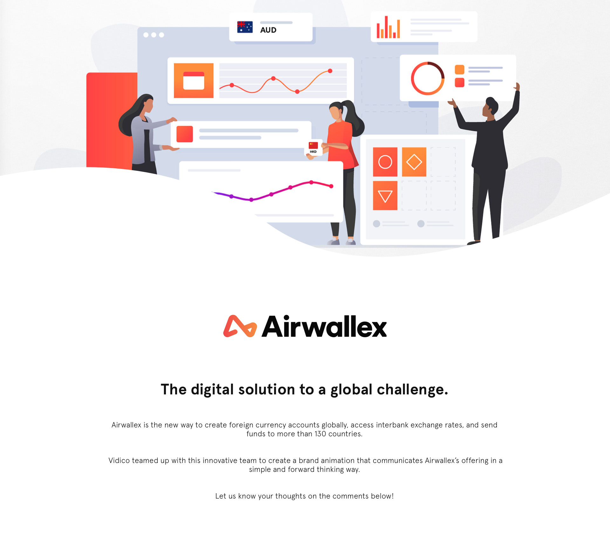

# FinTech Case Study
### Fintech Revolution
When fintech emerged in the 21st century, the term was initially applied to the technology employed at the backend systems of established financial institutions, such as banks. From 2018 or so to 2023, there was a shift to consumer-oriented services. Fintech now refers to the integration of technology into offerings by financial services companies to improve their use and delivery to consumers. Airwallex company is one of fintech companies in Australia, which was established in Melbourne 2015. Airwallex is a payments platform transforming the way businesses move and manage money globally.

